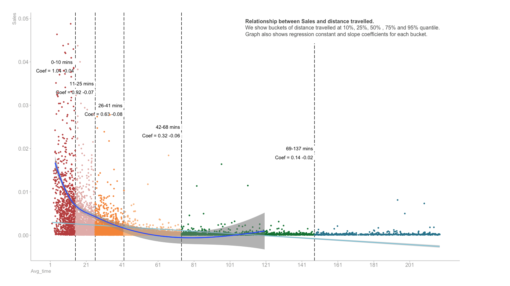

New Sites Model
================
Waleed Idrees (Data Scientist)
2023-02-26

# link to the code:

<https://github.com/WaleedIdrees/DataStory/blob/main/dis_reg.Rmd>

# Introduction to Model

This model is build to understand the relationship between distance
traveled and number of Sales of a product from retail stores. Model
takes the data from existing customers who bought the product. We want
to find out how much distance customers a willing to travel to buy. So
we use total Sales as target variable and distance as the explanatory
variable and we see the relationship between distance customer travel to
buy from retail stores.

# Data Collection

Explanatory variables is distance traveled in minutes. This information
can be useful to help us figure out how much customers are willing to
travel and how far two retail stores should be to avoid cannibalization.

Total population variable is taken from Office of national statistics
website. Population data is collected from 2011 census from office of
national statistics website. Its not been updated since past 10 years
but that’s the only info we can collect at the moment for free.

# Descriptive Statistics

Final data used in this model has 24147 conversations. Average Sales
from each sector is 8, with a max of 463 Sales. Average time travelled
to site is 69 mins and the max time traveled is 933 mins.

|             | vars |     n |      mean |       sd |   median |   min |      max |    range |
|:------------|-----:|------:|----------:|---------:|---------:|------:|---------:|---------:|
| No_of_tests |    2 | 14194 |  9.608496 | 21.23177 |  3.00000 | 1.000 | 462.0000 | 461.0000 |
| Avg_time    |    3 | 14194 | 68.974240 | 77.32510 | 41.79583 | 1.325 | 933.4167 | 932.0917 |

Descriptive Statistics of no of tests and explanatory variables

## Model

Graphs below shows a people buying within different time buckets. the
relationship between the average time and Sales is given in each bucket
using a regression equation.

our constant for people who live within 0-10 mins distance explains that
1% of people who live from 0-10 mins distance get the test regardless of
the avg time travel. However, as the time increases by 1 min we may
loose 0.04 test.

The constant decreases as the average time traveled increases from 1.04
in 0-10 zone to .014 in 69-137 zone. Also the coefficient of effect gets
smaller as we move from a smaller time zone to larger time zone.

<!-- -->
